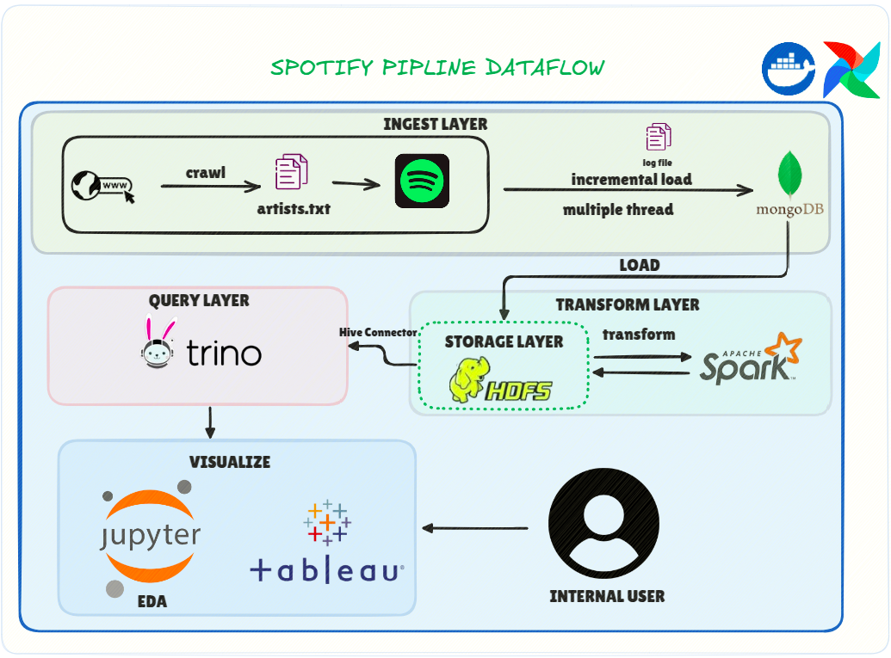
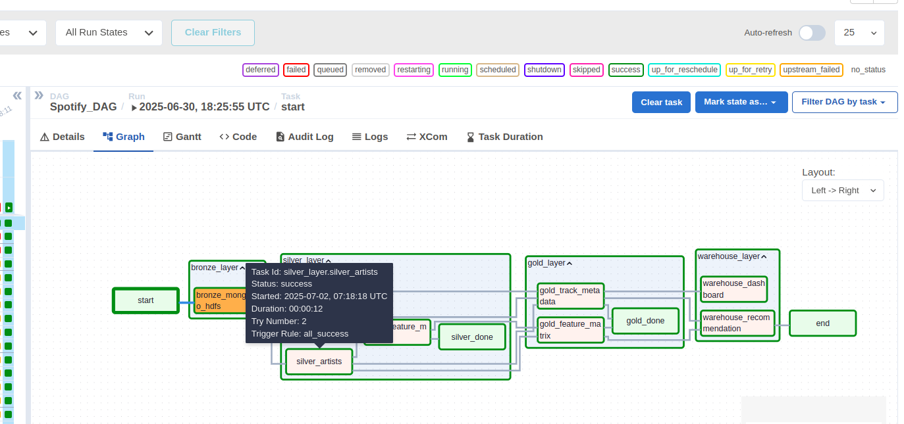
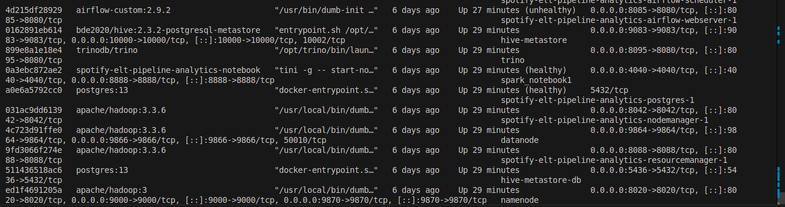
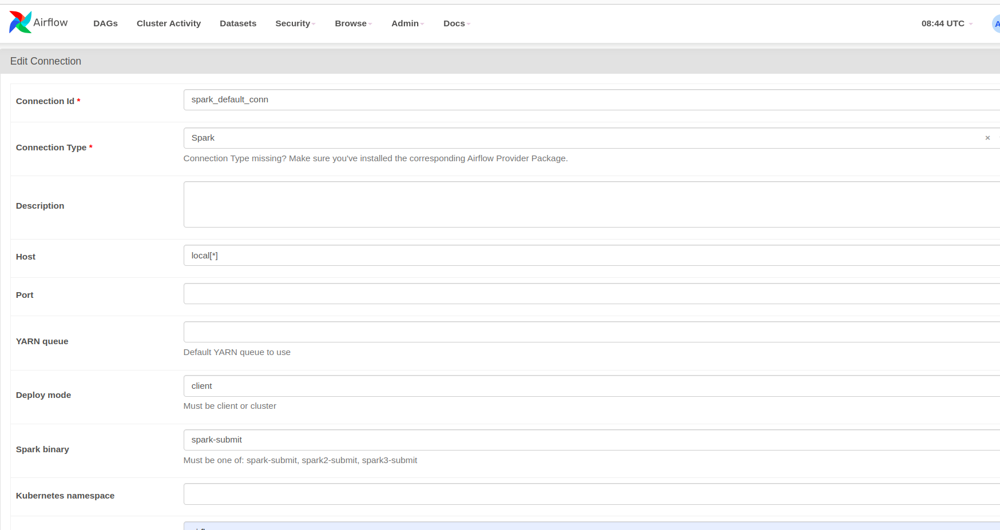
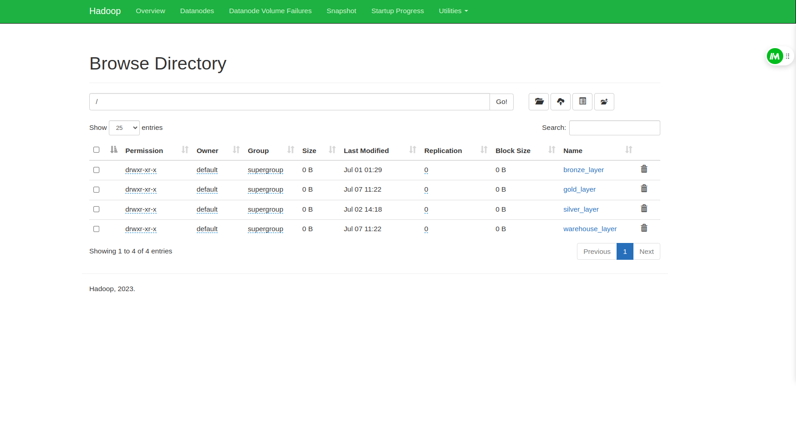
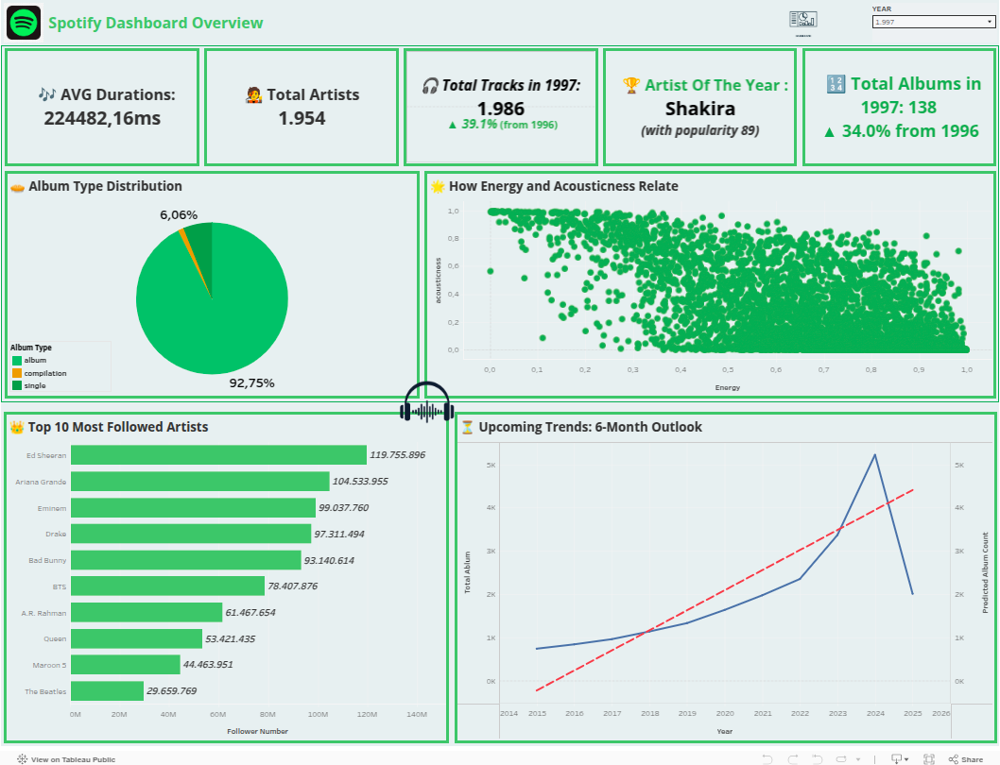

# Spotify Data Pipeline

The **Spotify Data Pipeline** project aims to build a scalable and automated workflow that collects, processes, and analyzes music data from the [Spotify Developer API](https://developer.spotify.com/).  
It starts by crawling artist names from [kworb.net's Spotify artist page](https://kworb.net/spotify/artists.html), which ranks the most listened-to artists globally.

These artist names are saved to a plain text file (`artists.txt`) and used as input to fetch detailed music metadata and audio features from the Spotify API.

The pipeline then continues through several stages — from ingestion and transformation to querying and visualization — leveraging a modern big data tech stack including MongoDB, Spark, HDFS, Trino, and Tableau.

This project is ideal for learning how to connect real-world APIs with distributed storage, processing, and analytics tools in a production-like environment.

<p align="center">
  
</p>

---

# Project Goals

This project is built as a learning-focused data engineering pipeline with the primary goal of mastering how to collect and move data from multiple sources into a centralized system in a clean, reliable, and structured format.

The end objective is to provide high-quality datasets that enable **Data Scientists (DS)** and **Data Analysts (DA)** to generate insights through analysis and visualization.

Through this project, the developer aims to gain hands-on experience with:
- Designing a real-world data ingestion & transformation flow
- Handling semi-structured and API-based data
- Implementing ETL/ELT best practices
- Building a scalable pipeline that supports downstream analytics

---

# Pipeline Design



1. We use **Docker** to containerize each service, and optionally integrate **Airflow** for orchestration and scheduling future enhancements.
2. Artist names are crawled from [kworb.net](https://kworb.net/spotify/listeners.html), then stored in a plain text file (`artists.txt`) as the pipeline's input source.
3. Using multi-threaded Python scripts, each artist name is passed into the **Spotify API**, retrieving data on artists, albums, tracks, and audio features.
4. The raw JSON responses from the API are stored in **MongoDB**, simulating a semi-structured NoSQL landing zone.
5. Data from MongoDB is extracted and loaded into **HDFS** as raw files.
6. From HDFS, **Apache Spark (PySpark)** is used to clean, normalize, and join data into structured datasets (silver & gold layers).
7. Transformed Spark DataFrames are written back into **HDFS** in `.parquet` format for efficient storage and querying.
8. **Trino**, connected through the **Hive Metastore**, is used to query parquet data directly from HDFS.
9. **Tableau** connects to Trino to build interactive dashboards, while **Jupyter Notebooks** are used independently for EDA and feature analysis.

---

# Data Layer Breakdown

1. General :



2. Bronze Layer :

- **artists_raw**: Raw JSON data of artist metadata fetched from Spotify API.
- **albums_raw**: Raw album information per artist, including release date, label, and popularity.
- **tracks_raw**: Raw track data for each album, including track name, duration, and popularity.
- **audio_features_raw**: Technical audio features (e.g., danceability, energy, valence...) per track.
- **genres_raw**: Genre list per artist, often containing multiple genre tags.

All of these datasets are ingested directly from the **Spotify API**, and stored unprocessed in **MongoDB** as the raw landing zone.

---

3. Silver Layer :

- **silver_artists**: Cleaned and normalized artist data. Removed nulls, renamed columns, and flattened nested fields.
- **silver_album**: Album metadata with standardized date formats and cleaned column names.
- **tracks_data**: Flattened track table with clear schema (`track_id`, `artist_id`, `album_id`, etc.).
- **silver_feature_music**: Cleaned audio features dataset matched to track_id and artist.
- **silver_artists_genres**: Exploded genre list per artist into multiple rows for easier aggregation.

Data from MongoDB is exported to **HDFS** datalake and cleaned using **PySpark** before being stored in Parquet format.

---

4. Gold Layer :

- **gold_track_metadata**: A fully joined dataset combining tracks, albums, artists, and genres. Aggregated genre tags per artist using `collect_set`, and ensured one record per track.
- **gold_feature_matrix**: Technical audio features enriched with track name and artist name, prepared for visualization and machine learning tasks.

This layer represents a **business-meaningful view** of the data, curated for downstream analytics.

---

5. Warehouse Layer :

- **warehouse_track_dashboard**: Combined dataset of track metadata and audio features, used for Tableau dashboards.
- **warehouse_track_recommendation**: Clean feature matrix prepared for building a content-based recommendation system.

All outputs are stored in **Parquet format on HDFS**, and can optionally be migrated into warehouse for further reporting or analytics.


# Set up environment

```bash
git clone https://github.com/GiaPhus/Spotify-ELT-Pipeline-Analytics.git
cd spotify-data-pipeline
```

---

### Create Environment Files

Create two required files: `.env` and `hadoop.env`

#### `.env`

```env
SPOTIFY_CLIENT_ID=your_spotify_client_id
SPOTIFY_CLIENT_SECRET=your_spotify_client_secret
MONGO_URI=your_mongo_uri
```

#### `hadoop.env`

```env
CORE_CONF_fs_defaultFS=hdfs://namenode:8020
HDFS_CONF_dfs_replication=1
```

> You can find sample templates in `.env.example` and `hadoop.env.example`

---

### Set Up Docker

This project uses [Apache Airflow's official Docker Compose setup](https://airflow.apache.org/docs/apache-airflow/stable/howto/docker-compose/index.html).

Run the following to initialize Airflow metadata and create the default user:

```bash
docker compose up airflow-init
```
Once all setup steps are complete, it’s time to build the Docker images for this project.  
Use the following command:

```bash
make build
```

> ⏳ This process may take a few minutes depending on your machine. Sit back, relax, and enjoy a coffee ☕

If the build fails, try the following:
- Restart Docker
- Remove any existing image with the same name using `docker image rm <image_id>`
- Then run `make build` again

---

Once initialization completes, start all services in detached mode:

```bash
docker compose up -d
```

This will launch all defined services such as:
- Airflow (scheduler, webserver, worker)
- MongoDB
- HDFS (Namenode, Datanode)
- Hive, Trino
- JupyterLab

---

After starting all services, you can run the following command to verify that all containers are running:

```bash
docker ps
```

You should see containers like:



---

### Check Running Services

Once the system is up, open the following URLs in your browser to make sure each service is working correctly:

| Service             | URL                                | Notes                       |
|---------------------|-------------------------------------|-----------------------------|
| Airflow Web UI      | http://localhost:8080              | Username: `airflow` / Password: `airflow` |
| Jupyter Notebook    | http://localhost:8888              | Token shown in terminal log |
| Trino UI            | http://localhost:8082              | SQL query engine            |
| Hive Metastore      | http://localhost:9083              | Internal API port           |
| Hadoop Namenode     | http://localhost:9870              | HDFS web UI                 |
| Hadoop Datanode     | http://localhost:9864              | HDFS worker node status     |
| Hadoop ResourceManager | http://localhost:8088          | YARN Resource Manager UI    |
| Hadoop NodeManager  | http://localhost:8042              | YARN Node Manager UI        |

Make sure that **Airflow**, **Jupyter**, and **HDFS** services are accessible.  
If anything appears unhealthy, try:

```bash
docker compose restart <service_name>
```

Or shut down and rebuild:

```bash
make down
make build
make up
```

---
---

# Run the Pipelines

This project includes **2 main pipelines**:

1. **Crawl Pipeline** – Gathers artist data from a public website and Spotify API, then stores the raw data into MongoDB.
2. **ETL Pipeline** – Reads data from MongoDB, processes it through Spark, stores into HDFS, and organizes it into Bronze → Silver → Gold → Warehouse layers.

---

### Run the Crawl Pipeline (MongoDB Ingestion)

#### Step 1: Access the Airflow UI

Visit: [http://localhost:8050](http://localhost:8050)  
Default credentials:
- **Username:** `airflow`
- **Password:** `airflow`

#### Step 2: Trigger the DAG `crawl_and_ingest_data_into_mongoDB`

1. Locate the DAG named `crawl_and_ingest_data_into_mongoDB`
2. Click the **Play ▶ button** to trigger it
3. Monitor its progress through "Graph View" or "Logs"

> 💡 **Tips:**  
> The purpose of this flow is to prepare your raw data and store it in MongoDB.  
> Once finished, you should see **4 collections** created in your MongoDB Atlas database.  
> It's recommended to **run this pipeline a few times** to make sure all artist data is fetched before proceeding to the next pipeline.

---

### Run the ETL Pipeline (Spark Transformation + Data Lake)

Once you have confirmed the data is in MongoDB:

### Set up Spark Connection in Airflow

To allow Airflow to trigger Spark jobs via the `SparkSubmitOperator`, you need to configure a Spark connection inside the Airflow UI before running the ETL pipeline.

### What We Use in This Project

In this project, we use **`local[*]` mode**, which is simple to set up and optimized for development environments and smaller datasets. No Spark cluster setup is required.

---

### Simplified SparkSession Management

To simplify the creation and cleanup of Spark sessions, we use a utility context manager called `SparkIO` using Python's `contextlib`:

```python
from pyspark.sql import SparkSession
from pyspark import SparkConf
from contextlib import contextmanager

@contextmanager
def SparkIO(conf: SparkConf = SparkConf()):
    app_name = conf.get("spark.app.name")
    master = conf.get("spark.master")
    print(f'Create SparkSession app {app_name} with {master} mode')
    spark = SparkSession.builder.config(conf=conf).getOrCreate()
    try:
        yield spark
    except Exception:
        raise Exception
    finally:
        print(f'Stop SparkSession app {app_name}')
        spark.stop()
```

This utility ensures that your SparkSession is always properly created and terminated, reducing boilerplate and minimizing the risk of resource leaks.

---

#### Steps:

1. Open the Airflow Web UI: [http://localhost:8050](http://localhost:8050)
2. Click on **"Admin" → "Connections"**
3. Click the **➕ (Add a new record)** button
4. Fill in the form as follows:



5. Save the connection

> ✅ The `Conn Id` must match the one used in your DAGs, typically `spark_default`.

After this setup, your Airflow DAG will be able to submit Spark jobs to the Spark master container.


#### Step 1: Trigger the DAG `Spotify_DAG`

1. Go back to Airflow UI
2. Find the DAG named `Spotify_DAG`
3. Click **Play ▶ button** to run it

This DAG will perform the following:

- Extract data from MongoDB and write to **HDFS (Bronze Layer)**
- Clean and process data using **Spark (Silver & Gold Layers)**
- Output final datasets to the **Warehouse Layer**, ready for querying with Trino and visualizing in Tableau

> ⚠️ **Important:** Always make sure the `Spotify_DAG` has completed successfully before running the ETL pipeline. The ETL depends on the data collected in the first step.

---

### Verify Output in HDFS

After running the ETL pipeline, you can verify that the data has been successfully written to HDFS by visiting the **HDFS Namenode Web UI**:

👉 [http://localhost:9870/explorer.html#/](http://localhost:9870/explorer.html#/)


From there, you can browse through directories like:

- `/bronze_layer/`
- `/silver_layer/`
- `/gold_layer/`
- `/warehouse_layer/`



Make sure you see the `.parquet` files inside the correct folders. These are the outputs created by your Spark jobs, and they will be read later by Trino for querying and Tableau for visualization.

>  Tip: If a folder doesn’t show up, check the Airflow logs to confirm the pipeline completed successfully without errors.

---

## Querying the Data Lake: Trino + Tableau Integration

In this project, the final processed data is stored in **HDFS**, which serves as our **Data Lake**.  
However, HDFS is not a query engine — you cannot directly run SQL queries on files stored there like you would in a traditional database.

### So how can we query HDFS data?

There are **two common approaches**:

1. **Load data from HDFS into a Data Warehouse** (like PostgreSQL, Snowflake, BigQuery…) — this adds another storage and transformation layer.
2. **Use a Query Layer** like **Trino**, **Presto**, or **Hive LLAP** that allows SQL querying directly over HDFS-stored files (like Parquet or ORC).

In this project, we chose **Trino** as the query layer for better performance and compatibility with tools like **Tableau**.

---
---

## Trino Configuration Setup

To enable Trino to query data stored in HDFS via the Hive connector, a few important configuration files must be created. These files are already included in the project structure:

### Folder Structure

```bash
hive/
├── conf/
│   └── hive-site.xml                # Hive metastore configuration (used by Spark and Trino)
├── ddl/
│   └── dashboard_warehouse.sql      # DDL to register warehouse tables
└── metastore/                       # Metadata directory (binds with PostgreSQL container)

trino/
├── catalog/
│   └── hive.properties              # Trino Hive connector settings
└── etc/
    ├── catalog/                     # Contains symbolic link to hive.properties
    ├── config.properties            # Trino coordinator configuration
    ├── jvm.config                   # JVM settings
    └── node.properties              # Trino node identity and environment settings
```

---

### File Descriptions

#### `hive-site.xml`
Located in `hive/conf/`, this file contains Hive metastore settings, including:

- Metastore URI
- Warehouse directory in HDFS
- Connection to PostgreSQL (as metastore backend)

#### `hive.properties`
Found in `trino/catalog/`, this file tells Trino how to connect to Hive:

```properties
connector.name=hive
hive.metastore.uri=thrift://hive-metastore:9083
hive.config.resources=/etc/hadoop/conf/core-site.xml,/etc/hadoop/conf/hdfs-site.xml
```

#### `config.properties` (Trino Coordinator)
Controls basic Trino setup:

```properties
coordinator=true
node-scheduler.include-coordinator=true
http-server.http.port=8082
query.max-memory=2GB
query.max-memory-per-node=1GB
discovery-server.enabled=true
discovery.uri=http://localhost:8082
```

#### `jvm.config`
JVM configuration for Trino runtime:

```bash
-server
-Xmx2G
-XX:+UseG1GC
```

#### `node.properties`
Each Trino node (coordinator or worker) must have a unique identity:

```properties
node.environment=production
node.id=trino-coordinator
node.data-dir=/var/trino/data
```

---

### Creating Hive Tables (Optional)

In the `hive/ddl/dashboard_warehouse.sql` file, you can define Hive tables over the final Parquet datasets in HDFS, for example:

```sql
CREATE EXTERNAL TABLE IF NOT EXISTS warehouse_track_dashboard (
    track_id STRING,
    track_name STRING,
    ...
)
STORED AS PARQUET
LOCATION 'hdfs://namenode:8020/warehouse_layer/warehouse_track_dashboard';
```

---

---

## 💤 Final Step – Let the Data Speak!

Now that the data has been:

- Crawled from external sources
- Cleaned and transformed with Spark 
- Stored in HDFS and organized into bronze/silver/gold layers
- Queried efficiently via Trino

... it's time for **Data Engineers to take a nap 😴**.

From this point on, it's the turn of **Data Analysts** and **Data Scientists** to jump in. They’ll:

- Query the gold & warehouse layers using Trino
- Build visualizations and dashboards in **Tableau**  
- Extract insights and tell meaningful stories with the data
- Build Recommendation System  

> ✅ The Spotify ELT Pipeline is now complete and production-ready for analysis.

---

### BI Tool Compatibility

Once Trino is connected to the warehouse (HDFS via Hive Metastore), you can easily use **any modern BI tool** to visualize the data.

- 🧩 **Metabase** is the easiest to connect with Trino and works out of the box
- 📊 However, for this project, **Tableau** was chosen due to familiarity and strong visual design features

> 🎯 Simply connect Tableau to Trino via the JDBC driver, and you're ready to start creating dashboards.

---

### Dashboard (Built with Tableau)
#### Overview Page 



---
---

# What’s Next?

This project currently focuses on building a robust ELT pipeline for Spotify music data, but there’s plenty of room to scale and experiment further.

Here are some exciting directions planned for future iterations:

### 🎵 1. Music Recommendation System (ML)
- Use the **feature matrix** and **metadata** in the warehouse layer
- Apply technical such as:
  - **Content-based filtering**
  - **Clustering (e.g., KMeans)**
  - **Dimensionality reduction (e.g., PCA, t-SNE)**
  - **LSTM**
- Output song recommendations based on acoustic similarity or user mood

> Note: LSTM is a Deep Learning technique designed for sequential data. It’s more powerful than traditional ML models but requires more data and training time.
>  Bonus: Build a **Streamlit App** to recommend tracks and visualize clusters interactively

---

### 2. Real-Time Streaming Pipeline
- Integrate **Kafka** to ingest real-time track data (e.g., live charts or user events)
- Process streams with **Spark Structured Streaming**
- Store data in **HDFS** or **Delta Lake**
- Build real-time dashboards with **Grafana** or **Streamlit**

---

### 3. Add More Data Sources
- Crawl more public APIs (e.g., Last.fm, Genius, Billboard)
- Enrich the dataset with **lyrics**, **user behaviors**, or **mood classification**
- Incorporate social media or geo-location data for deeper analysis

---

Whether it’s streaming, machine learning, or advanced analytics — this pipeline is built to scale and ready to grow.
Stay tuned!